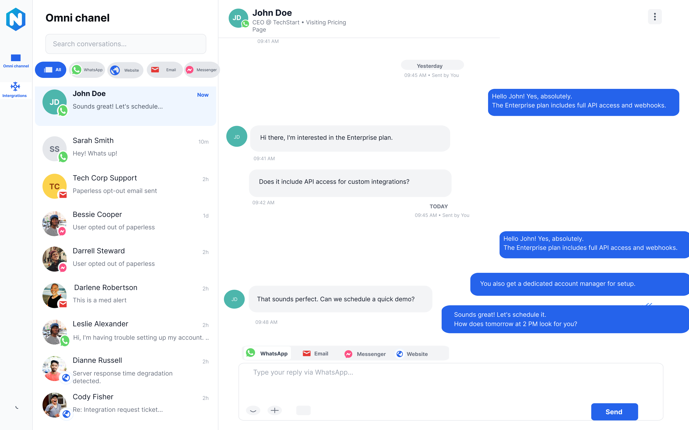
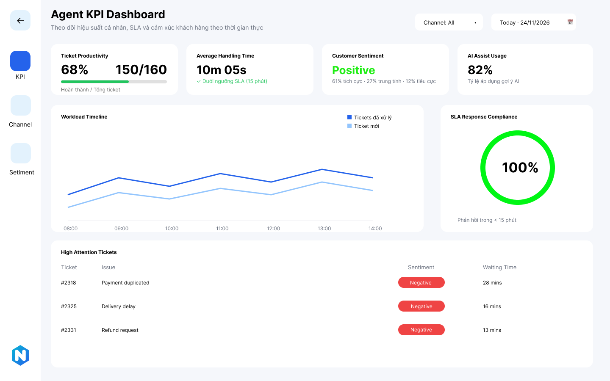
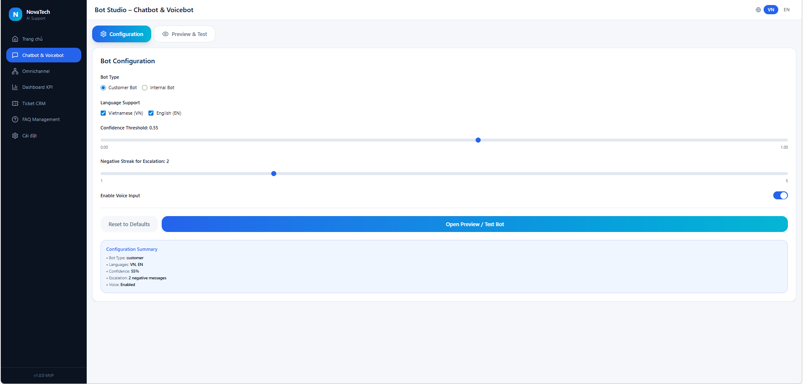
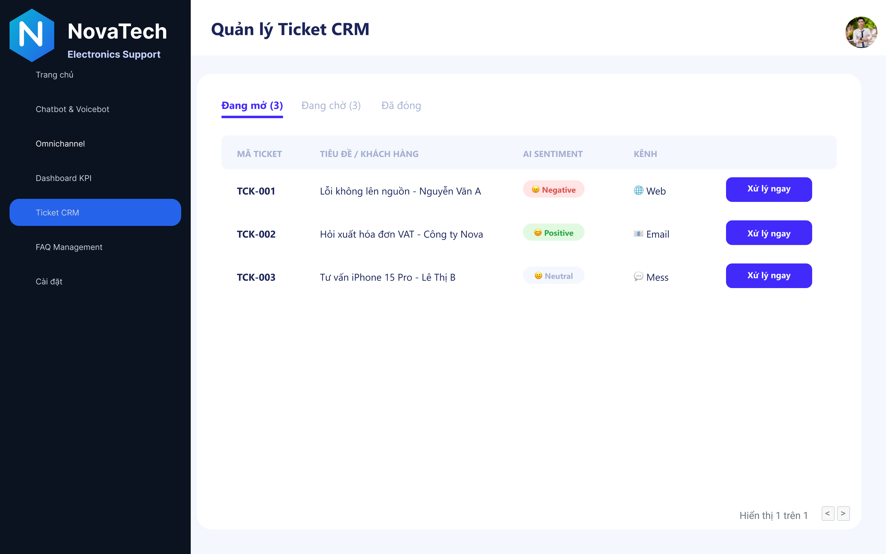

# Dự án: AI-Assisted Customer Support Platform (ACSP)

**Tác giả:** Anh Duy, Anh Khoa, Thùy Dương, Ngô Thịnh

---

## Mô Tả Dự Án

AI-Assisted Customer Support Platform (ACSP) là hệ thống hỗ trợ chăm sóc khách hàng thông minh giúp doanh nghiệp tự động hóa quá trình hỗ trợ khách hàng.

Nền tảng này tích hợp trí tuệ nhân tạo (AI) để xử lý và phản hồi các yêu cầu của khách hàng trên nhiều kênh giao tiếp khác nhau.

Hệ thống cho phép doanh nghiệp:

- Tự động trả lời các câu hỏi thường gặp của khách hàng bằng chatbot và voicebot
- Quản lý hội thoại khách hàng từ nhiều kênh khác nhau trong một hệ thống duy nhất
- Phân tích cảm xúc khách hàng để nâng cao chất lượng dịch vụ
- Tự động tạo và quản lý ticket hỗ trợ trong hệ thống CRM

Nhờ đó doanh nghiệp có thể:

- Giảm chi phí nhân sự
- Tối ưu quy trình chăm sóc khách hàng
- Nâng cao trải nghiệm khách hàng (Customer Experience – CX)

---

## Mục Tiêu Dự Án

- Tự động hóa quy trình chăm sóc khách hàng
- Giảm khối lượng công việc cho đội ngũ hỗ trợ
- Tăng tốc độ phản hồi khách hàng
- Cung cấp dashboard phân tích dữ liệu
- Quản lý hội thoại khách hàng tập trung

---

## Tính Năng Chính

- **Chatbot & Voicebot đa ngôn ngữ**  
  Sử dụng NLP để tự động trả lời khách hàng bằng nhiều ngôn ngữ

- **Omnichannel Communication**  
  Tích hợp Website, Email, WhatsApp, Messenger

- **Dashboard KPI & Sentiment Analysis**  
  Theo dõi hiệu suất và cảm xúc khách hàng

- **Tự động tạo Ticket CRM**  
  Tạo ticket hỗ trợ khi chatbot không thể xử lý yêu cầu

---

## Màn Hình Chính

## Hướng Dẫn Sử Dụng

- Đăng nhập hệ thống
- Kết nối các kênh giao tiếp
- Theo dõi hội thoại khách hàng
- Xem dashboard phân tích
- Quản lý ticket hỗ trợ
